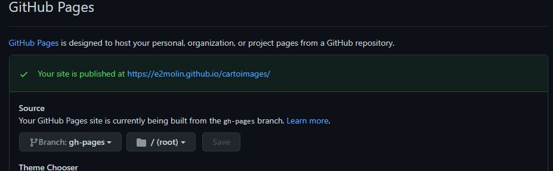
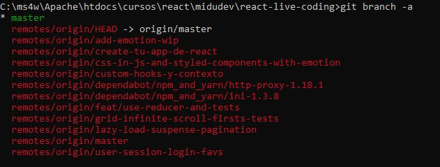

# REACT
https://infopeli.web.app/ Genial https://github.com/AlexandroMunera/React-InfoPeli
https://es.reactjs.org/

## Instalación

Clonar el repositorio de GitHub. 

```bash
git clone https://github.com/e2molin/cartoimages.git
```

Después acceder a la carpeta del proyecto y ejecutar NPM para bajar los paquetes de desarrollo.

```bash
npm install
```

## Clase 0 y 1


## Premisas

*  React es declarativo: En el modo de trabajo imperativo, cuando hacemos una web decimos que este botón haga esto. Esto es imperativo. Declarativo no damos acciones, decimos loo que queremos hacer

* Se basa en componentes reutilizables.

* JSX es una extensión de la sintaxis de JavaScript. Se recomuenda usarlo con React para describir cómo debería ser la interfaz de usuario. JSX puede recordarte a un lenguaje de plantillas, pero viene con todo el poder de JavaScript.


## Clase: Crea una app con React usando create-react-app

📽 https://youtu.be/QBLbXgeXMU8

### Create-React-app

Es una utilidad de Facebook para crear aplicaciones REACT. Se puede llegar a publicación pero no renderiza en servidor (Server Side Rendering - SSR). Para empezar es la mejor opción.

Para empezar vamos a instalar usando el comando **npx** de Node.JS las librerías necesarias para comenzar la aplicación.

```bash
npx create-react-app
```

Create React App configura tu set-up de desarrollo. Como gestor de paquetes propone el uso de **Yarn**, que es el NPM de Facebook. Pero podemos utilizar el propio NPM. En nuestro set-up de desarrollo también hay un control de versiones GIT. Si el proyecto lo vamos a utilizar en varios equipos, es interesante subirlo a github.

Para ello, después de crear el repositorio en GitHub, podemos configurar el repositorio remote en nuestro GIT local

```bash
git remote add origin https://github.com/e2molin/cartoimages.git
```

Y luego continuar con el flujo habitual de trabajo

## Clase 2

### Custom Hooks

Nos permiten usar snippets de códigos en varios sitios


### Despliegue de la App en Github

```bash
npm i gh-pages
```

Después añadimos algunas líneas a nuestro *package.json*. Una es la propiedad *homepage* que contiene la ruta que tendrá nuestra aplicación desplegada. Se compone del subdominio de nombre nuestro usuario, con el dominio github.io, seguido del nombre del proyecto, como se ve en el ejemplo.

```json
{
  "name": "cartoimg",
  "version": "0.1.0",
  "private": true,
  "homepage":"https://e2molin.github.io/cartoimages",
  "dependencies": {
```

Después, entre las lista de scripts, añadimos dos, *predeploy* y *deploy*, con comandos de *gh-pages* para hacerlo.

```json
  "scripts": {
    "predeploy":"npm run build",    // Este es opcional, ya que es un build mondo y lirondo
    "deploy":"gh-pages -d build",   // Este es el que sube el contenido de la carpeta a github.io
    "start": "react-scripts start",
    "build": "react-scripts build",
    "test": "react-scripts test",
    "eject": "react-scripts eject"
  },
```
En nuestro repositorio, vamos a settings y configuramos este despliegue




## Recursos y consejos de desarrollo

Es mejor usar promesas que una librería tipo Axios para llamadas AJAX. Si vamos a trabajar on navegadores que no soporten promnesas fetch/then, podemos usar un polyfill de fetch como unfetch , [https://github.com/developit/unfetch](https://github.com/developit/unfetch)

Para trabajar con *routing* se recomienda **Wouter**.
[https://github.com/molefrog/wouter](https://github.com/molefrog/wouter)

```bash
npm install wouter
```
Más sencillo que React-Router


### Descargar un branch remoto cuando usamos GIT

Del proyecto de trabajo del curso, me interesa descargar un branch dremoto que coincide con el comienzo del vídeo 3. Para ello lo mrimero es clonarme el proyecto entero en ele equipo.

```bash
#Clonamos el repositorio
git clone https://github.com/midudev/react-live-coding.git
# Listamos las ramas, y veremos todas las remotas y las locales
git branch -a
```
En la imagen comprobamos que las rojas son las remotas, todas con el prefijo *remotes*, y en local sólo tenemos la *master* para trabajar, que es lo que hay en el directorio de trabajo por defecto cuando clonamos un proyecto la primera vez.



Continuamos. Ahora vamos a crear en local una rama con el mismo nombre que la rama remota que queremos bajar, nos cambiaremos a esa rama y bajaremos el código del remoto correspondiente a esa rama. La rama que quremos se llama *lazy-load-suspense-pagination*.

```bash
# Creamos la tama en local con el mismo nombre y nos cambiamos a la rama
git checkout -b lazy-load-suspense-pagination origin/lazy-load-suspense-pagination
# Listamos para comprobar que se ha creado
git branch -a
# Bajamos el código romoto correspondiente a esa rama
git pull origin lazy-load-suspense-pagination
```
En la imagen se ve cómo despues del comando checkout, hemos creado una rama y nos hemos movido a ella, está en color verde.


Después de este proceso ya podemos trabajar con los ficheros de la rama remota


## NEXT.JS

Framework para crear aplicaciones en REACT.JS

📽 [https://www.youtube.com/watch?v=EEDRcolSHms&list=RDCMUC8LeXCWOalN8SxlrPcG-PaQ&start_radio=1&t=63](https://www.youtube.com/watch?v=EEDRcolSHms&list=RDCMUC8LeXCWOalN8SxlrPcG-PaQ&start_radio=1&t=63)

## Recursos

* **Ramdom Avatar**: Genera usuarios aleatorios para trabajar. [https://randomuser.me/](https://randomuser.me/)
* **Unplush**: imágenes libres para testear código [unsplash.com/](https://unsplash.com/)