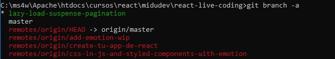

# REACT
https://infopeli.web.app/ Genial https://github.com/AlexandroMunera/React-InfoPeli
https://es.reactjs.org/

## Instalación

Clonar el repositorio de GitHub. 

```bash
git clone https://github.com/e2molin/cartoimages.git
```

Después acceder a la carpeta del proyecto y ejecutar NPM para bajar los paquetes de desarrollo.

```bash
npm install
```

## Clase 0 y 1


## Premisas

*  React es declarativo: En el modo de trabajo imperativo, cuando hacemos una web decimos que este botón haga esto. Esto es imperativo. Declarativo no damos acciones, decimos loo que queremos hacer

* Se basa en componentes reutilizables.

* JSX es una extensión de la sintaxis de JavaScript. Se recomuenda usarlo con React para describir cómo debería ser la interfaz de usuario. JSX puede recordarte a un lenguaje de plantillas, pero viene con todo el poder de JavaScript.


## Clase: Crea una app con React usando create-react-app

 📽 https://youtu.be/QBLbXgeXMU8

### Create-React-app

Es una utilidad de Facebook para crear aplicaciones REACT. Se puede llegar a publicación pero no renderiza en servidor (Server Side Rendering - SSR). Para empezar es la mejor opción.

Para empezar vamos a instalar usando el comando **npx** de Node.JS las librerías necesarias para comenzar la aplicación.

```bash
npx create-react-app
```

Create React App configura tu set-up de desarrollo. Como gestor de paquetes propone el uso de **Yarn**, que es el NPM de Facebook. Pero podemos utilizar el propio NPM. En nuestro set-up de desarrollo también hay un control de versiones GIT. Si el proyecto lo vamos a utilizar en varios equipos, es interesante subirlo a github.

Para ello, después de crear el repositorio en GitHub, podemos configurar el repositorio remote en nuestro GIT local

```bash
git remote add origin https://github.com/e2molin/cartoimages.git
```

Y luego continuar con el flujo habitual de trabajo

## Clase 2

### Concepto del *useState* y *useEffect*

El hook *useState* es uno de los más conocidos de React. Nos permite definir una propiedad y el modo en el que cambia. En el siguiente snippet vemos cómo tenemos dos variables, GIFS y DIFFERENT_GIFS, y queremos que al pulsar un botón cambien, de manera que nuestra App pase de renderizar los tres primeros a renderizar los tres últimos.

```javascript
import React, {useEffect,useState} from 'react';
import './App.css'

const GIFS=['https://media3.giphy.com/media/rj12FejFUysTK/giphy.gif',
            'https://i.giphy.com/media/13kajTax0GCg0g/giphy.webp',
            'https://i.giphy.com/media/8lJwA6kNkKyfC/giphy.webp',
            ];

const DIFFERENT_GIFS=['https://i.giphy.com/media/j2pWZpr5RlpCodOB0d/giphy.webp',
                      'https://i.giphy.com/media/3oxHQpJKupQXsmU1JS/giphy.webp',
                      'https://i.giphy.com/media/6268H2Uc3mAQsLMIe3/giphy.webp',
                      ];

export default function App() {
  
  const [gifs, setGifs] = useState(GIFS);

  useEffect(function() {
    console.log("Me ejecuto tras renderizar");
    setGifs(DIFFERENT_GIFS);
    }, []);

    return (
    
    <div className="App">
      <section className="App-content">
        {
          // Por cada string del array generamos una etiqueta  y renderizamos una imagen
          // Usamos un map en vez de un foreach porque el map devuelve algo, el foreach no devuelve nada, luego no renderizaría. El map tiene un return implícito
          gifs.map(singleGif => )
        }
        <button onClick={()=>setGifs(DIFFERENT_GIFS)}>Cambiar Gifs</button>
      </section>
    </div>
    )
  }
```

Pero imaginemos que lo que queremos es que al entrar en el componente, automáticamente cambien las imágenes, sin esperar a que pulsemos el botón. Para ello necesitamos una función que se ejecute cada vez que nuestro componente se renderice. Eso lo conseguimos con otro hook de React, el *useEffect*. El código anterior ejecutará el efecto al arrancar, y si pulso el botón, volverá a hacerlo.
Pero ojo, si pongo un cam,bio en los GIFS en el interior del efecto, puede provicr un bucle infinito, ya que se renderiza -> cambia GIFs -> renderiza -> cambia GIFs -> renderiza -> Cambia GIFs -> ... Para evitarlo, se reciben dos parámetros. La función que utilizamos y las dependencias que tiene este efecto. Esta lista de dependencias, la ponemos vacía de entrada, lo que hará que el efecto se renderice sólo una vez.

Usando la API de Giphy podemos ver un caso de cómo funciona esto.

```javascript

const apiURL='https://api.giphy.com/v1/gifs/search?api_key=IjmmViOE2rq5nh9jplq6JWU32Dcak2Ju&q=elefante'

export default function App() {
  //Usamos un Hook
                        
  const [gifs, setGifs] = useState(GIFS);

  useEffect(function() {
    fetch(apiURL)   // Hago llamada a la API
      .then(res => res.json())  // Recibo respuesta que es una cadena y la convierto a JSON
      .then(response =>{
        const {data=[]} = response; // Extraigo del JSON el valor del array data
        const gifs_downloaded=data.map(image =>image.images.downsized_medium.url); // De cada objeto del array extraigo la ruta de la imagen
        setGifs(gifs_downloaded); // Actualizo el estado
      })
    }, []);

  return (
      <div className="App">
        <section className="App-content">
          {
            gifs.map(singleGif=>)
          }
          <button onClick={()=>setGifs(DIFFERENT_GIFS)}>Cambiar Gifs</button>
        </section>
      </div>
  )
```


## Clase 3

### Composición de rutas para acceder a controles, servicios y hooks

A la hora de poner las rutas de los componnetes, es un poco tediosos ir navegando con rutas del estilo **'../../components/ListaGifs'** tomando como referecia el directorio *root*. Se puede definir una URL base a partir de la cual se componen las rutas usando un fichero de configuración **jsconfig.json**, de manera que la nueva ruta sea **'components/ListaGifs'**.

```json
{
  "compilerOptions": {
    "baseUrl": "src"
  }
}
```

### intersection-observer

Nos permite detectar cuando un elelemnto está en el viewport, por lo tanto se muyestra al usuario, y en ese momento se puede lanzar alguna acción como cargar un servicio.


## Recursos y consejos de desarrollo

### Clonación del Proyecto

El proyecto está en Github con el archivo de dependencias *package.json* pero sin los *node_modules*, que se evitan gracias al archivo *.gitignore*. Una vez clonado el repositorio, para que funcione es necesario ejecutar un *npm install* para que se descargue todos los paquetes de node necesarios.

```bash
git clone https://github.com/e2molin/cartoimages.git
npm install
```


### Despliegue de la App en Github

```bash
npm i gh-pages
```

Después añadimos algunas líneas a nuestro *package.json*. Una es la propiedad *homepage* que contiene la ruta que tendrá nuestra aplicación desplegada. Se compone del subdominio de nombre nuestro usuario, con el dominio github.io, seguido del nombre del proyecto, como se ve en el ejemplo.

```json
{
  "name": "cartoimages",
  "version": "0.1.0",
  "private": true,
  "homepage":"https://e2molin.github.io/cartoimages",
  "dependencies": {
```

Ojo 💣, cuando se establece la propiedad *homepage*, al ejecutar un *npm run start*, la aplicación no se carga en http://localhost:3000, sino en http://localhost:3000/cartoimages. Esto me ha vuelto loco del todo.

Después, entre las lista de scripts, añadimos dos, *predeploy* y *deploy*, con comandos de *gh-pages* para hacerlo.

```json
  "scripts": {
    "predeploy":"npm run build",    // Este es opcional, ya que es un build mondo y lirondo
    "deploy":"gh-pages -d build",   // Este es el que sube el contenido de la carpeta a github.io
    "start": "react-scripts start",
    "build": "react-scripts build",
    "test": "react-scripts test",
    "eject": "react-scripts eject"
  },
```
En nuestro repositorio, vamos a settings y configuramos este despliegue


Es mejor usar promesas que una librería tipo Axios para llamadas AJAX. Si vamos a trabajar on navegadores que no soporten promnesas fetch/then, podemos usar un polyfill de fetch como unfetch , [https://github.com/developit/unfetch](https://github.com/developit/unfetch)

Para trabajar con *routing* se recomienda **Wouter**.
[https://github.com/molefrog/wouter](https://github.com/molefrog/wouter)

```bash
npm install wouter
```
Más sencillo que React-Router


### Descargar un branch remoto cuando usamos GIT

Del proyecto de trabajo del curso, me interesa descargar un branch dremoto que coincide con el comienzo del vídeo 3. Para ello lo mrimero es clonarme el proyecto entero en ele equipo.

```bash
#Clonamos el repositorio
git clone https://github.com/midudev/react-live-coding.git
# Listamos las ramas, y veremos todas las remotas y las locales
git branch -a
```
En la imagen comprobamos que las rojas son las remotas, todas con el prefijo *remotes*, y en local sólo tenemos la *master* para trabajar, que es lo que hay en el directorio de trabajo por defecto cuando clonamos un proyecto la primera vez.


Continuamos. Ahora vamos a crear en local una rama con el mismo nombre que la rama remota que queremos bajar, nos cambiaremos a esa rama y bajaremos el código del remoto correspondiente a esa rama. La rama que quremos se llama *lazy-load-suspense-pagination*.

```bash
# Creamos la tama en local con el mismo nombre y nos cambiamos a la rama
git checkout -b lazy-load-suspense-pagination origin/lazy-load-suspense-pagination
# Listamos para comprobar que se ha creado
git branch -a
# Bajamos el código romoto correspondiente a esa rama
git pull origin lazy-load-suspense-pagination
```
En la imagen se ve cómo despues del comando checkout, hemos creado una rama y nos hemos movido a ella, está en color verde.



Después de este proceso ya podemos trabajar con los ficheros de la rama remota


## NEXT.JS

Framework para crear aplicaciones en REACT.JS

 📽 [https://www.youtube.com/watch?v=EEDRcolSHms&list=RDCMUC8LeXCWOalN8SxlrPcG-PaQ&start_radio=1&t=63](https://www.youtube.com/watch?v=EEDRcolSHms&list=RDCMUC8LeXCWOalN8SxlrPcG-PaQ&start_radio=1&t=63)

## Recursos

* **Ramdom Avatar**: Genera usuarios aleatorios para trabajar. [https://randomuser.me/](https://randomuser.me/)
* **Unplush**: imágenes libres para testear código [unsplash.com/](https://unsplash.com/)